# Stash - Sistema de Manutenção Residencial 🏠

## Sobre o Projeto

Stash é um aplicativo móvel desenvolvido para conectar usuários a profissionais qualificados em serviços de manutenção residencial e comercial. Inspirado no modelo de negócios do Uber, o aplicativo visa facilitar o acesso a serviços como pintura, eletricidade e outras áreas de manutenção, oferecendo uma plataforma que conecta clientes a profissionais de forma rápida e eficiente.

### Principais Funcionalidades 🛠️

- Cadastro e autenticação de usuários e profissionais
- Sistema de busca e filtro de serviços
- Avaliação e feedback dos serviços prestados
- Sistema de pagamento integrado
- Gerenciamento de perfil profissional
- Histórico de serviços
- Sistema de contratação e confirmação de serviços

## Screenshots do Aplicativo 📱

### Telas do Usuário

<div style="display: flex; justify-content: space-between;">
    
    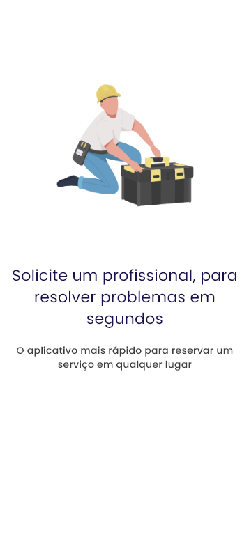
    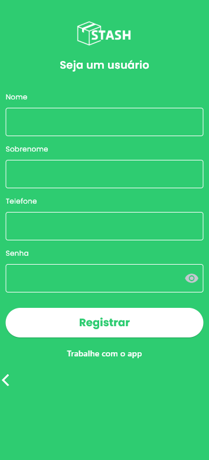	
    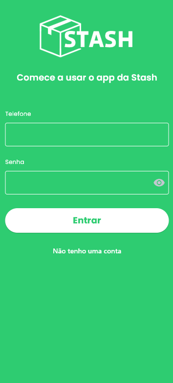
</div>

### Área do Cliente

<div style="display: flex; justify-content: space-between;">
    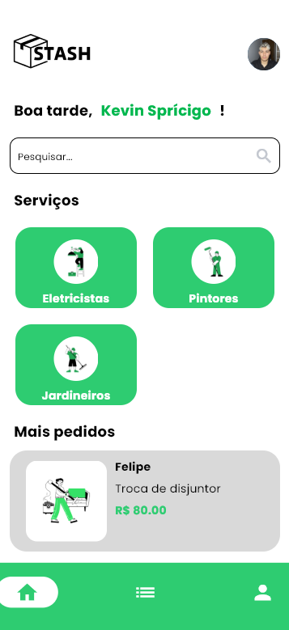
    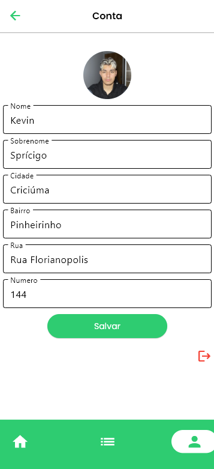
    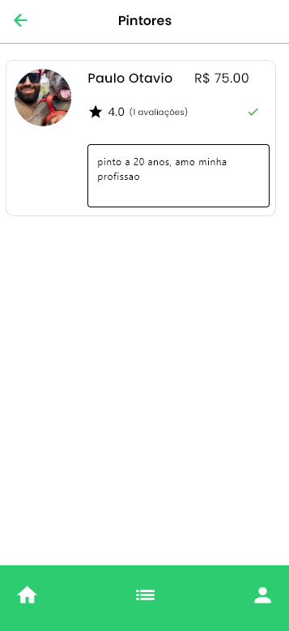
</div>

### Processo de Contratação

<div style="display: flex; justify-content: space-between;">
    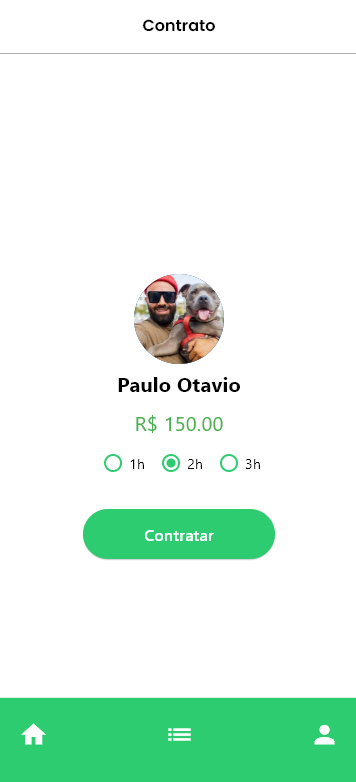
    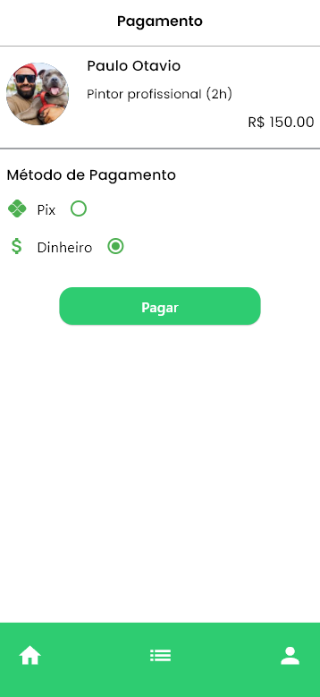
    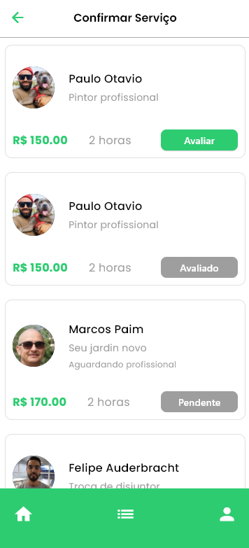
    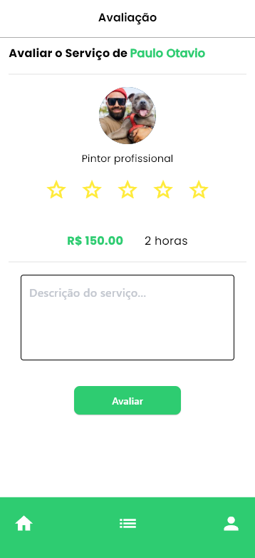
</div>

### Área do Profissional

<div style="display: flex; justify-content: space-between;">
    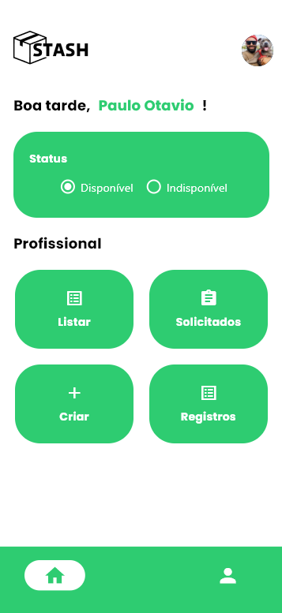
    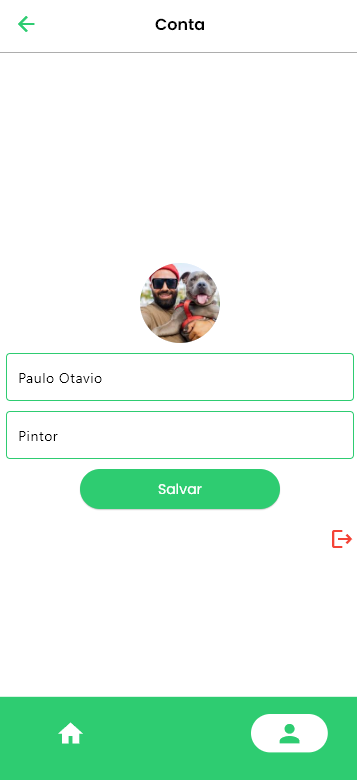
    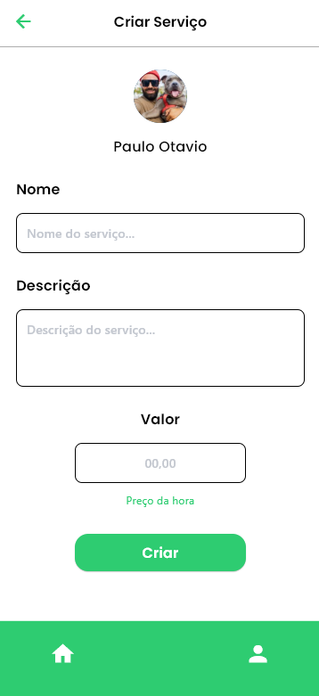
</div>

### Gerenciamento de Serviços

<div style="display: flex; justify-content: space-between;">
    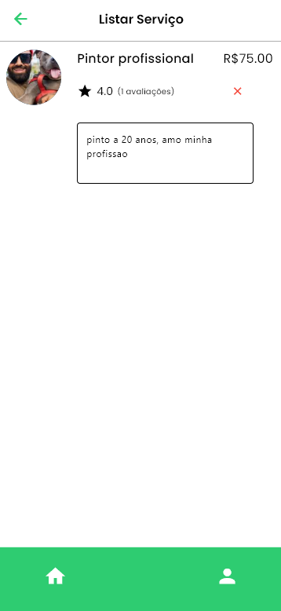
    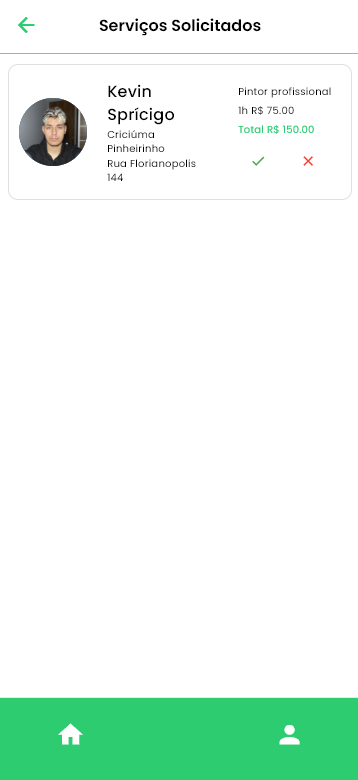
    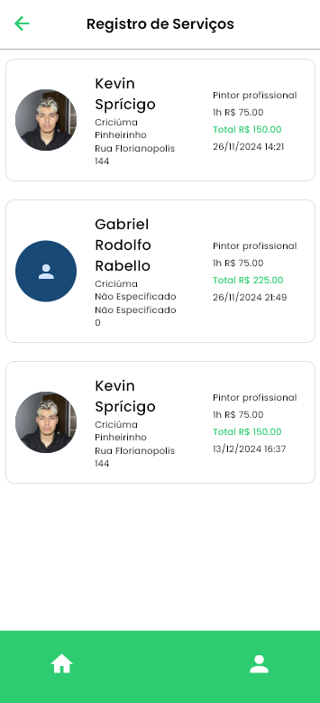
</div>

## Tecnologias Utilizadas 💻

- **Frontend:**
  - Python
  - Flet (Framework UI)
  
- **Backend:**
  - PostgreSQL
  - Supabase
  
- **Ferramentas de Desenvolvimento:**
  - Visual Studio Code
  - Astah (Modelagem UML)
  - Figma (Design de Interface)
  - Canva (Design Gráfico)

## Arquitetura do Sistema 🏗️

O sistema foi desenvolvido seguindo uma arquitetura moderna e escalável, utilizando:

- Banco de dados PostgreSQL para armazenamento
- Supabase como plataforma de backend
- Interface responsiva desenvolvida com Flet
- Sistema de autenticação seguro
- APIs RESTful para comunicação

## Requisitos do Sistema ⚙️

### Requisitos Funcionais Principais:

- Cadastro e autenticação de usuários
- Gerenciamento de perfis profissionais
- Sistema de busca e filtros
- Avaliação e feedback
- Processamento de pagamentos
- Histórico de serviços

### Requisitos Não Funcionais:

- Segurança de dados com criptografia
- Alta performance no processamento
- Tempo de resposta inferior a 3 segundos
- Sistema escalável

## Instalação e Uso 📲

1. Clone o repositório:
```bash
git clone https://github.com/KevinSpricigo/stash-tcc.git
```

2. Instale as dependências:
```bash
pip install -r requirements.txt
```

3. Execute o aplicativo:
```bash
python main.py
```

## Implementações Futuras 🚀

- Modo escuro para melhor experiência visual
- Sistema de avaliação expandido com critérios detalhados
- Novas categorias de serviços
- Integração com IA para recomendações
- Sistema de chat em tempo real

## Autores 👨‍💻

- [@KevinSpricigo](https://github.com/KevinSpricigo)
- [@Samuel-Fraga](https://github.com/Samuel-Fraga)
---
Desenvolvido como projeto de conclusão de curso no CEDUP - Criciúma/SC - 2024
